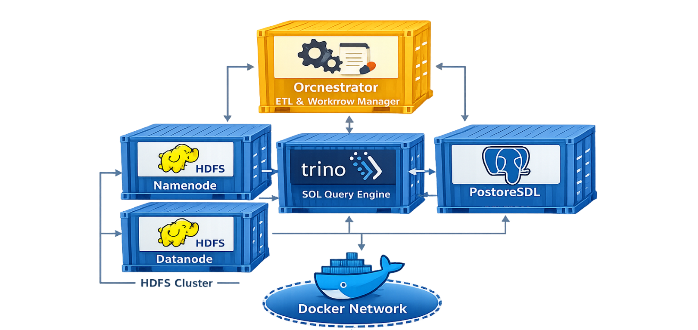
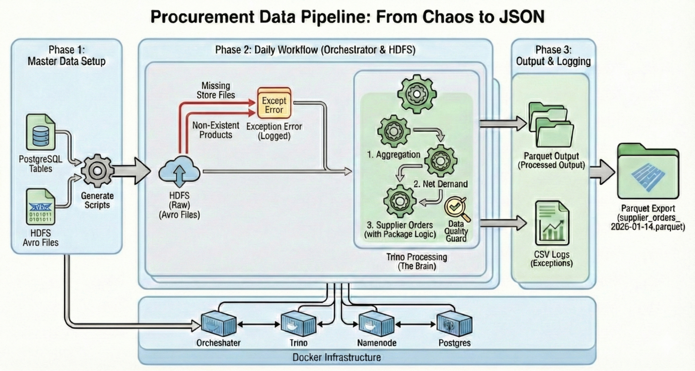

# batch-procurement-data-pipeline
Simplified batch-oriented data pipeline for a procurement system using HDFS, Presto, Hive Metastore, and PostgreSQL. The project demonstrates core data engineering concepts such as data ingestion, metadata management, batch processing, net demand calculation, and supplier order generation.


# 🚀 Procurement Data Pipeline

A **production-style batch data pipeline** that simulates, processes, validates, and transforms procurement data using **Python, HDFS, and Trino**.

This project demonstrates how modern data engineering pipelines work end-to-end:
from **raw ingestion** → **SQL processing** → **analytics outputs** → **data governance**.

---

## 🧠 What this project shows

* How to build a **real data lake pipeline**
* How to use **Trino** as a distributed SQL engine
* How to store data in **Avro → Parquet**
* How to implement **data quality & exception handling**
* How to make pipelines **re-runnable by date**

---

## 🏗️ Architecture
###  Docker architecture

###  Pipeline architecture



#### Main steps

- Environment setup

- HDFS folder creation

- Data generation (faker / simulation)

- Aggregation of orders (Trino)

- Net demand computation (Trino)

- Supplier order generation (Trino)

- Data quality checks

- Exception report export

---

## 📁 Repository Structure

```
.
├──scripts/
│   ├── orchestrator_scheduler.py          # Main pipeline runner
│   ├── generate_daily_files.py # Raw data simulation (Avro)
│   ├── aggregate_orders.py     # Sales aggregation (Trino)
│   ├── net_demand.py           # Net demand calculation
│   ├── supplier_orders.py     # Purchase order generation
│   ├── data_quality.py        # DataQualityGuard
│   ├── pg_client.py
│   └── hdfs_client.py
│
├── data/
│   ├── raw/
│   ├── processed/
│   ├── output/
│   └── logs/
│
├── docker-compose.yml
└── README.md
```

---

## 🔄 Data Flow

### 1️⃣ Raw layer (Avro – HDFS)

```
/raw/orders/{RUN_DATE}/
/raw/stock/{RUN_DATE}/
```

### 2️⃣ Processed layer (Parquet – HDFS)

```
/processed/aggregated_orders/{RUN_DATE}/
/processed/net_demand/{RUN_DATE}/
```

### 3️⃣ Output layer

```
/output/supplier_orders/{RUN_DATE}/
```

### 4️⃣ Governance

```
/logs/exceptions/date={RUN_DATE}/exceptions.csv
```

---

## ⚙️ Tech Stack

* **Python 3.10+**
* **Trino** – distributed SQL engine
* **HDFS** – data lake storage
* **PostgreSQL** – reference & control data
* **Docker / Docker-Compose**
* **Avro** – raw ingestion format
* **Parquet** – analytics format

---

## 🚀 Pipeline Execution

### Run for today

```bash
python orchestrator.py
```

### Run for a specific date

```bash
RUN_DATE=2025-12-20 python orchestrator.py
```

### Run with Docker

```bash
docker-compose up --build
```

---

## 🔎 What happens in the pipeline

### Step 0 — Setup

* Create HDFS folder structure
* Load environment variables
* Initialize **DataQualityGuard**

### Step 1 — Data Generation

* Simulates daily orders & stock
* Writes **Avro** locally
* Uploads to HDFS

### Step 2 — Aggregation (Trino)

* Reads Avro from HDFS
* Aggregates orders per SKU & market
* Writes results in **Parquet**

### Step 3 — Net Demand

* Joins sales with stock
* Computes net demand

### Step 4 — Supplier Orders

* Applies MOQ & packaging rules
* Generates purchase quantities

### Step 5 — Data Quality

* Missing market files
* Unknown SKUs
* Stock inconsistencies

### Step 6 — Reporting

* Generates **exceptions report**
* Uploads to HDFS

---

## 🛡️ Data Quality Rules

| Rule            | Description              | Severity |
| --------------- | ------------------------ | -------- |
| MISSING_FILE    | Market did not send data | MEDIUM   |
| UNKNOWN_PRODUCT | SKU not in reference     | HIGH     |
| STOCK_LOGIC     | Reserved > Available     | HIGH     |
| PIPELINE_CRASH  | System failure           | CRITICAL |

All issues are saved in:

```
/logs/exceptions/date={RUN_DATE}/exceptions.csv
```

---

## 🌍 Environment Variables

| Variable      | Purpose         | Example                                      |
| ------------- | --------------- | -------------------------------------------- |
| RUN_DATE      | Processing date | 2025-12-20                                   |
| HDFS_BASE_URL | HDFS namenode   | [http://namenode:9870](http://namenode:9870) |
| HDFS_USER     | HDFS user       | root                                         |
| TRINO_HOST    | Trino service   | trino                                        |
| TRINO_PORT    | Trino port      | 8080                                         |

---

## 🎯 Why this project matters

This is not a simple script — it demonstrates:

* **Modern data lake architecture**
* **Schema-on-read processing**
* **Separation of storage & compute**
* **Reproducible batch pipelines**
* **Production-style logging**
* **Data governance mindset**

It is a strong **portfolio project** for:

* Data Engineering
* Big Data Systems
* Cloud Pipelines
* Analytics Engineering

---

## 🔮 Future Improvements

* Add **Airflow** for scheduling
* Add **Hive Metastore** for metadata
* Add **Superset** dashboards
* Add **Kafka** for streaming ingestion
* Add **Great Expectations** for data quality

